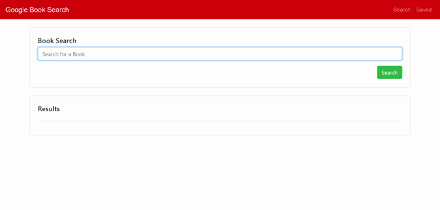

# Google-Books-Search

This app allows you to find a book using the Google Book API, and save it to a MongoDB-based database.

# Technologies used
- MongoDB  and Mongoose
- Express
- React
- Node
- Bootstrap

# The app in action

